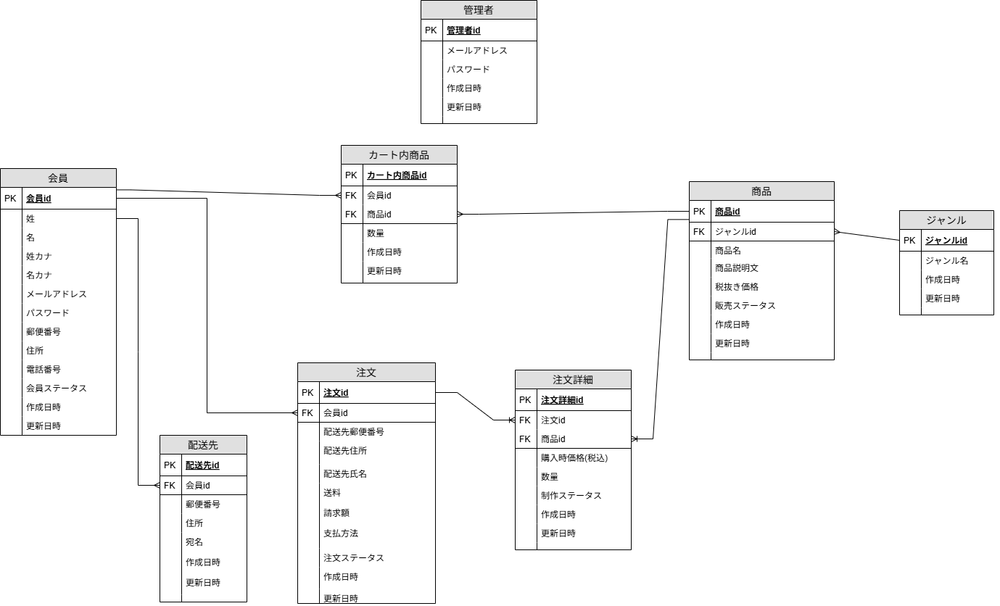
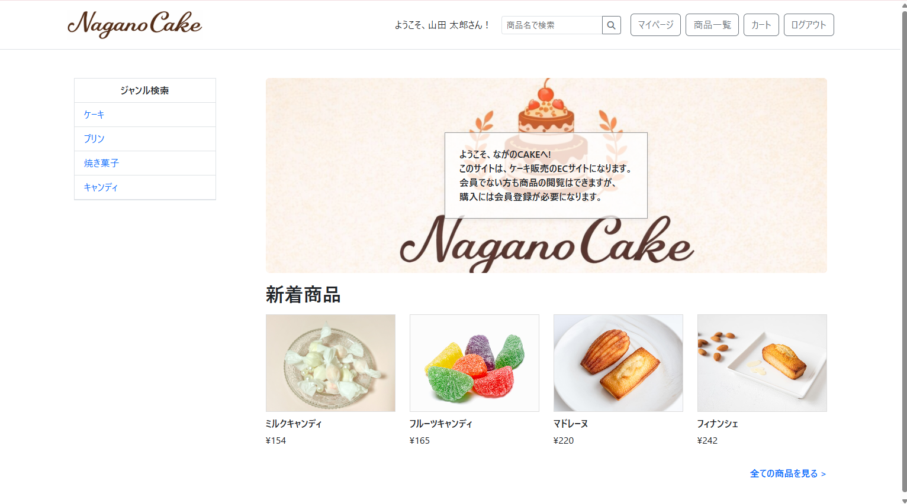
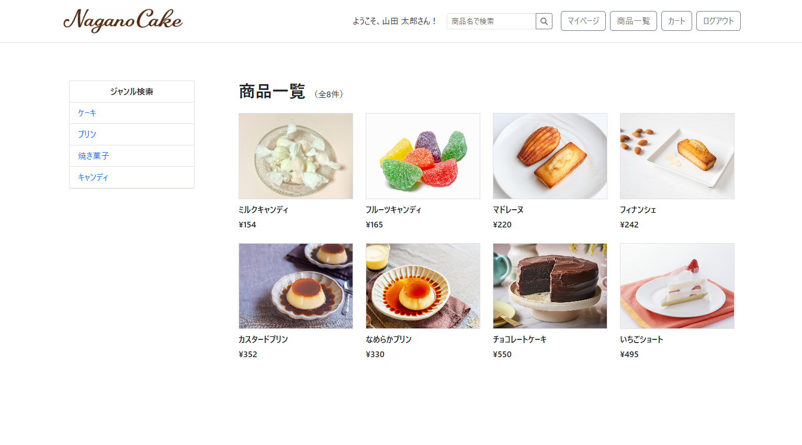
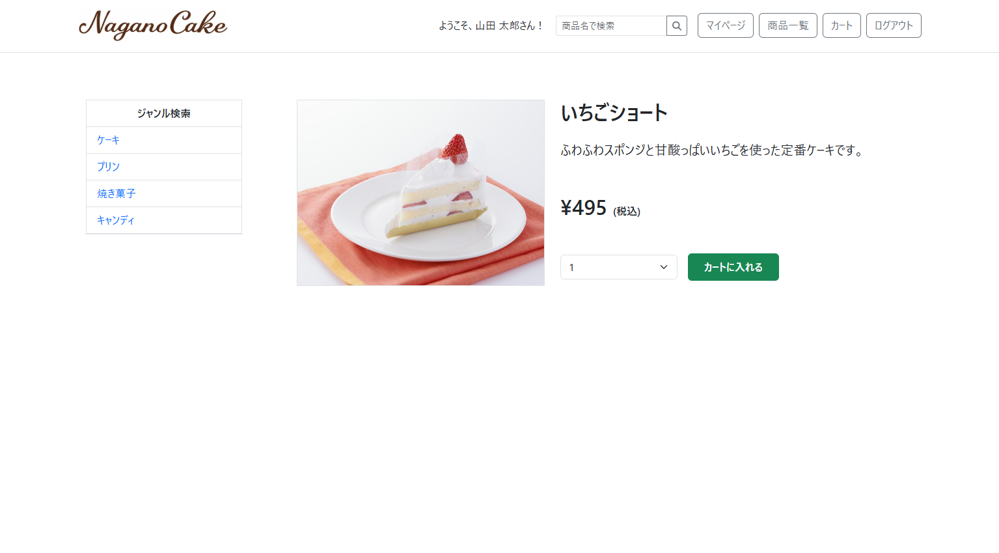
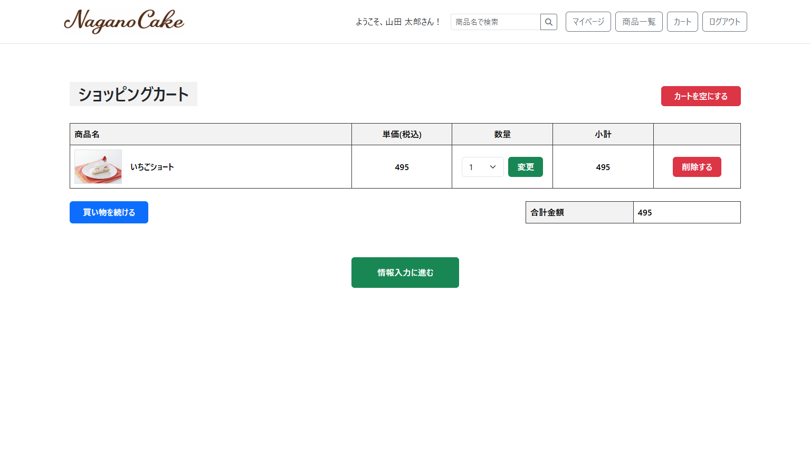
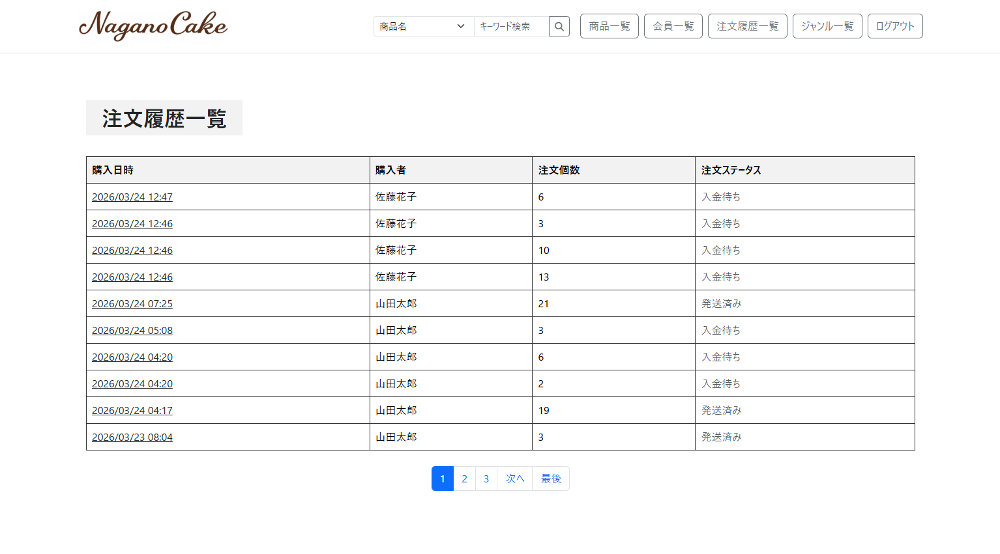

# NaganoCake

## アプリケーション概要

長野県にある洋菓子店「ながのCAKE」の商品を通販するためのECサイトです。
Instagramでの人気拡大により、DMやメールでの注文管理が煩雑になったため、注文管理機能を備えたWebアプリケーションとして開発しました。

会員は商品を閲覧・購入し、注文履歴を確認できます。
管理者は商品・会員・注文情報の管理を行うことができます。

---

## 制作背景

従来はInstagramのDMやメールで注文を受けていましたが、注文数の増加により情報管理が困難になりました。
そのため、注文・顧客情報・製作状況を一元管理できるECサイトを開発しました。

---

## 通販仕様

* 受注生産型（注文後に製作）
* 1日の注文数制限なし
* 送料：全国一律800円
* 複数配送先指定可能
* 支払方法：

  * クレジットカード
  * 銀行振込

---

## 主な機能

### 会員側
- 商品閲覧（一覧・詳細）
- カート機能（追加・編集・削除）
- 注文機能（配送先・支払方法設定）
- マイページ（会員情報・配送先・注文履歴）
- 商品検索・ジャンル検索

### 管理者側
- 商品・ジャンル管理
- 会員管理
- 注文管理（ステータス更新）

---

## ステータス設計

- 支払方法：クレジットカード / 銀行振込
- 注文ステータス：入金待ち → 発送済みまで管理
- 製作ステータス：製作不可 → 製作完了まで管理
- 会員ステータス：有効 / 退会

---

## 使用技術

* Ruby
* Ruby on Rails 8.0.4
* SQLite3
* HTML / CSS
* Bootstrap
* Git / GitHub
* Active Storage

---

## ソースコード

[GitHubリポジトリはこちら](https://github.com/a-trout-salmon/naganocake)

---

## ER図


---

## 画面イメージ
### トップページ


### 商品一覧画面


### 商品詳細画面


### カート画面


### 管理者画面


---

## セットアップ方法

```bash
git clone https://github.com/a-trout-salmon/naganocake
cd naganocake
bundle install

# 初回のみデータベース作成が必要です
bin/rails db:create

bin/rails db:migrate
bin/rails db:seed
bin/rails server
```

※ seed実行後、テストアカウントでログイン可能です  
※ Active Storageを使用しているため、画像データもローカルに保存されます。

---

## アクセスURL

- トップページ
  http://localhost:3000
- 会員ログイン
  http://localhost:3000/customers/sign_in
- 管理者ログイン
  http://localhost:3000/admin/sign_in

※ サーバー起動後（bin/rails server）、上記URLにアクセスしてください

---

## テストアカウント

### 会員側

| メールアドレス | パスワード |
|---------------|-----------|
| yamada@example.com | password |
| sato@example.com | password |
| suzuki@example.com | password |
| takahashi@example.com | password |

### 退会確認用

| メールアドレス | パスワード |
|---------------|-----------|
| withdrawn@example.com | password |

---

### 管理者側

| メールアドレス | パスワード |
|---------------|-----------|
| admin@example.com | password |

---

## 作成者

チーム名：Trout Salmon

* 宮谷昌希
* 森崎佳輝
* 吉岡大地
